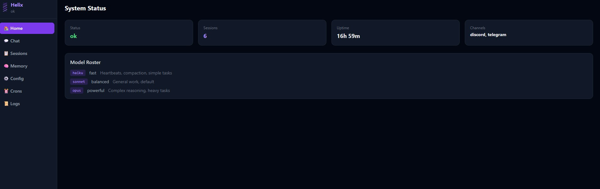
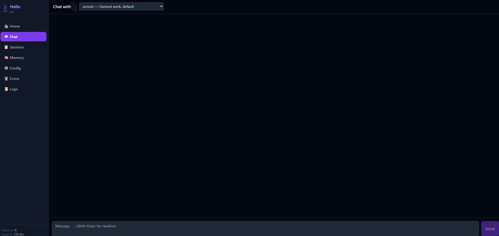
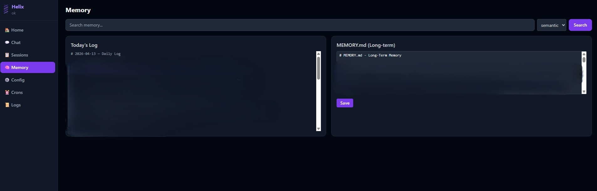
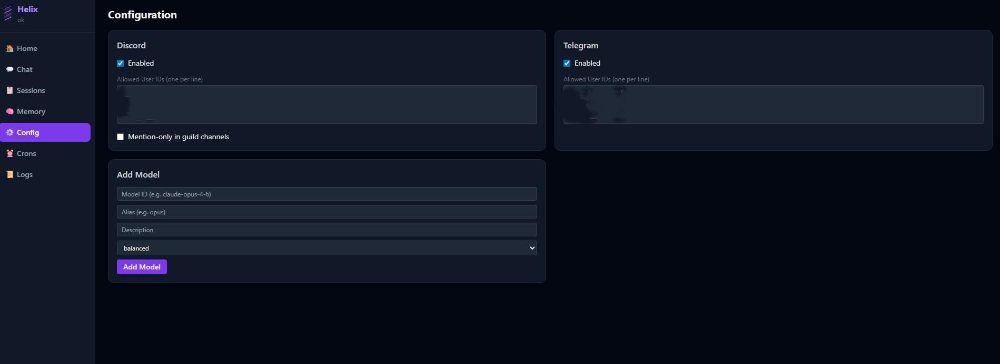
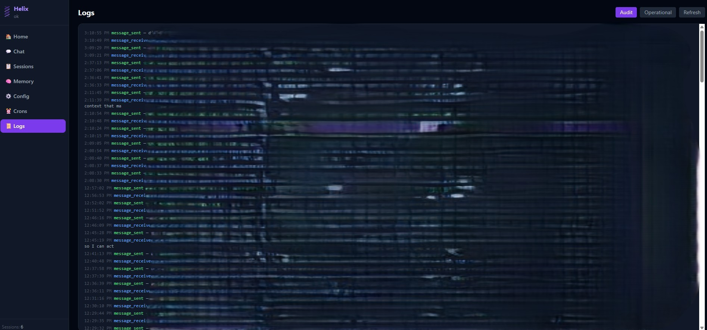
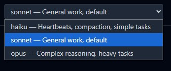

# Helix

A personal AI agent harness powered by Claude Code. Give your AI assistant a name, a personality, persistent memory, and always-on access through Discord, Telegram, or the built-in web UI.

Helix acts as a frontend for [Claude Code](https://docs.anthropic.com/claude-code) — all AI calls route through Claude's CLI using your existing subscription. No API keys needed.

**Ideal for anyone who wants a persistent, always-on Claude agent without living in a terminal.** Run it once, walk away — your agent is available through your phone, browser, or messaging app whenever you need it.

## Screenshots

| Home | Chat |
|------|------|
|  |  |

| Memory | Crons |
|--------|-------|
|  |  |

| Config | Logs |
|--------|------|
|  |  |

| Model Switch |
|-------------|
|  |

## What You Get

- **Persistent agent identity** — your agent has a name, personality, and memory that survives across sessions
- **Web admin UI** — chat with your agent, manage sessions, view logs, configure settings from your browser
- **Discord + Telegram Integration** — optional always-on messaging so you can talk to your agent from your phone
- **Memory system** — daily logs + long-term memory files your agent reads and writes automatically
- **Custom slash commands** — drop a `.md` file in the commands folder, it becomes a `/command`
- **Scheduled tasks** — cron jobs that run your agent on a schedule (heartbeat checks, automated workflows)
- **Encrypted secrets** — bot tokens and passwords stored with Fernet encryption, machine-bound keys

## Requirements

- **Python 3.10+**
- **Claude Code CLI** — [install here](https://docs.anthropic.com/claude-code)
- **Anthropic subscription** — Claude Pro or Max (Helix uses your subscription via Claude Code, no API key needed)
- **Linux or macOS** (Windows via WSL should work but is untested)

## Quick Start

```bash
git clone https://github.com/kingbee-helix/helix-agent.git
cd helix-agent
python3 main.py setup
```

The setup wizard handles everything:
- Creates a virtual environment and installs dependencies
- Walks you through naming your agent and setting your info
- Prompts you to set a web admin password
- Optionally connects Discord or Telegram
- Configures Claude Code permissions
- Offers to launch immediately

## Starting and Stopping

```bash
./start.sh    # Start in background (logs to ~/.helix/logs/helix.log)
./stop.sh     # Stop gracefully

# Or run directly (useful for debugging):
python3 main.py
```

The venv is managed automatically — you never need to activate it manually.

> **Note:** Helix does not auto-start on reboot. Use `./start.sh` to run it in the background without keeping a terminal open. You'll need to run it again if your machine restarts. Attempting to set it as a systemd service for auto-restart functions will throw Claude Code "extra usage" errors, it is not supported natively in Claude Code with subscription plans and will break oauth. DO NOT DO THIS!!

## Project Structure

```
helix/
  main.py              # Entry point — start Helix, run setup, manage secrets
  setup.py             # Interactive first-run wizard
  start.sh / stop.sh   # Background process management
  core/
    agent_loop.py      # Routes messages to Claude Code, streams responses back
    cli_backend.py     # Calls the claude CLI, manages sessions and flags
    config.py          # All configuration in one place (Pydantic models)
    context_engine.py  # Builds the system prompt from workspace files
    session_manager.py # Tracks sessions + transcripts in SQLite
  channels/
    base.py            # Shared adapter interface
    discord_adapter.py # Discord bot — DMs and guild channels
    telegram_adapter.py# Telegram bot — private chat
    slash_commands.py  # /command handling for all channels
  security/
    audit.py           # Logs every inbound/outbound event
    auth.py            # Allowlist enforcement + rate limiting
    input_validator.py # Flags prompt injection attempts
    secrets.py         # Fernet-encrypted credential store
  web/
    app.py             # FastAPI server — REST API + WebSocket chat
    static/index.html  # Browser-based admin dashboard
  workspace-template/  # Starter identity + memory files, copied to ~/.helix/workspace/ on setup
```

## How It Works

Helix wraps Claude Code's CLI (`claude -p`). When you send a message:

1. Your message arrives via Discord, Telegram, or the web UI
2. Helix loads your agent's identity files (AGENTS.md, SOUL.md, etc.) as the system prompt
3. The message is sent to Claude Code with `--resume` for session continuity
4. Claude Code handles everything — tool execution, file operations, web searches
5. The response comes back through the same channel

Your agent has access to the same tools as Claude Code: Bash, file read/write/edit, web search, web fetch. Permissions are managed through Claude Code's `~/.claude/settings.json`.

> **Why `--resume` matters:** Most Claude frontends resend the entire conversation history with every message, which burns tokens fast and hits rate limits quickly. Helix uses Claude Code's `--resume` flag to continue existing sessions — only the new message and system prompt are sent each turn. The full conversation context is preserved on disk and picked up automatically. The result is dramatically lower token usage, longer conversations before hitting limits, and true session persistence across restarts.

## Configuration

Everything lives in `~/.helix/`:

| Path | What |
|------|------|
| `config.json` | Main config (channels, models, scheduling) |
| `secrets.enc` | Encrypted secrets (bot tokens, passwords) |
| `workspace/` | Agent's workspace (identity, memory, tools) |
| `sessions/` | Session database + transcripts |
| `logs/` | Operational + audit logs |

Edit config through the admin UI, or directly:
```bash
python3 main.py config           # Print current config
python3 main.py secrets list     # List stored secret keys
python3 main.py secrets set KEY VALUE
```

## Agent Workspace

Your agent's workspace (`~/.helix/workspace/`) contains the files that define who it is:

| File | Purpose |
|------|---------|
| `AGENTS.md` | Operating instructions — how the workspace works |
| `SOUL.md` | Personality and principles |
| `IDENTITY.md` | Name, emoji, vibe |
| `USER.md` | Info about you |
| `MEMORY.md` | Long-term memory (agent updates this over time) |
| `TOOLS.md` | Notes about your specific setup |
| `HEARTBEAT.md` | What to check on periodic heartbeats |
| `memory/` | Daily logs (`YYYY-MM-DD.md`) |
| `commands/` | Custom slash commands (`.md` files) |

Edit these files anytime. The more accurate they are, the better your agent performs. Your agent can also edit them — that's how it learns and remembers.

> **Want more?** Helix's memory system can be extended with [Obsidian](https://obsidian.md) and semantic search tools like [qmd](https://github.com/qmd-lab/qmd) for a full knowledge base your agent can query. The flat file structure is designed to be compatible — just point your agent at the vault.

## Slash Commands

Available in Discord, Telegram, and the web chat:

| Command | What it does |
|---------|-------------|
| `/help` | List all commands |
| `/new` or `/reset` or `/clear` | Start a fresh session |
| `/compact` | Summarize and compress current session history |
| `/model [alias]` | Switch model (haiku / sonnet / opus) |
| `/status` | Session info + current model |
| `/session` | List all active sessions |
| `/memory` | View today's memory log |
| `/think [level]` | Deep reasoning mode |
| `/do <task>` | Execute a task |
| `/remember <text>` | Save something to memory |
| `/forget <text>` | Remove something from memory |
| `/heartbeat` | Trigger a manual heartbeat check |

### Switching Models Mid-Conversation

When you switch models, Helix automatically carries forward the last 30 exchanges so the new model has context on what you were working on.

> **Tip:** For long or complex conversations, run `/compact` before switching models. Helix will summarize the full session into a concise context block — making the handoff cleaner and cheaper on tokens. You can run `/compact` directly from Discord, Telegram, or the web chat — no terminal needed.

## Adding Permissions

Helix inherits permissions from Claude Code. During setup, your home directory is automatically added. To grant access to additional directories:

```bash
claude /permissions
```

Or manually edit `~/.claude/settings.json`.

## Security Notes

- The web UI runs on **localhost only** by default — not exposed to the network
- Bot tokens and passwords are **encrypted at rest** using Fernet with argon2id key derivation
- Encryption keys are **machine-bound** — secrets can't be decrypted on a different machine
- Discord and Telegram use **allowlists** — only your user ID can interact with the agent
- **Rate limiting** is built in (20/min, 200/hr per user)
- **Prompt injection detection** flags suspicious patterns in messages
- If you expose the web UI externally, use an HTTPS reverse proxy. **Do so at your own risk — Helix is designed for personal local use and external exposure is not officially supported.**

## License

MIT — see [LICENSE](LICENSE).
